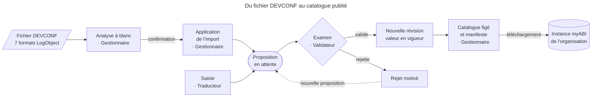

# Référentiel des traductions myABI · ARGE-ABI

Application web commune aux polices membres de l’ARGE-ABI pour gérer les traductions de myABI : import des sept formats DEVCONF de LogObject, recherche des termes, propositions et validation à quatre yeux, révisions, puis publication de catalogues figés par organisation.

- **Pile** : Laravel 13, PHP 8.4, MariaDB 11.4, pages Blade. Ni Node ni Redis en production : CSS et JavaScript sont livrés directement dans `public/`.
- **Interface** : allemand, français et italien, selon la [présentation myABI](DESIGN.md) (bandeau bleu nuit, onglets, navigation latérale, tableaux compacts). Toutes les ressources sont locales ; le bouton Compact mémorise la densité d’affichage dans le navigateur.
- **Confidentialité** : originaux, rapports et publications restent dans le stockage privé.
- **Périmètre** : les [spécifications fonctionnelles](specifications-fonctionnelles-referentiel-traductions-arge-abi.md), les [spécifications techniques](specifications-techniques-referentiel-traductions-arge-abi.md) et l’[annexe DEVCONF](docs/formats-devconf.md) font foi. Les points soumis à confirmation de LogObject sont signalés dans l’application ; ils ne sont pas résolus par des transformations silencieuses.

## Sommaire

- [Cycle d’une traduction](#cycle-dune-traduction)
- [Installation locale](#installation-locale)
- [Configuration](#configuration)
- [Traitements en arrière-plan](#traitements-en-arrière-plan)
- [Vérification](#vérification)
- [Extension navigateur MyAB Translation Inspector](#extension-navigateur-myab-translation-inspector)
- [Livraison et exploitation](#livraison-et-exploitation)
- [Données, licence et contribution](#données-licence-et-contribution)

## Cycle d’une traduction

Un terme passe de l’export DEVCONF au catalogue téléchargé par chaque organisation. Une traduction importée ou saisie reste une proposition tant qu’un Validateur ne l’a pas acceptée ; seule la validation crée une révision de la valeur en vigueur.



| Rôle | Responsabilités |
|---|---|
| Administrateur | Crée les organisations et invite des comptes nominatifs avec rôles et langues. Les invitations expirent après 72 heures. Consulte le journal d’audit. |
| Gestionnaire | Crée les versions myABI, téléverse un DEVCONF complet, examine l’analyse et ses anomalies puis confirme l’application ; la progression et le rapport restent consultables. Publie les catalogues pour les organisations choisies. Peut déroger au principe des quatre yeux, avec un motif audité. Consulte le journal d’audit filtrable et l’exporte en CSV. |
| Validateur | Examine les propositions dans ses langues, valide ou rejette avec un motif. Le serveur contrôle les valeurs examinées et les modifications concurrentes. |
| Traducteur | Recherche les termes de son périmètre et envoie explicitement ses propositions. Les caractères non exportables et les placeholders manquants bloquent l’envoi. |
| Lecteur | Consulte le référentiel et télécharge les publications disponibles pour son organisation. |

Les fichiers figés d’une publication et leur manifeste permettent de retrouver les valeurs publiées et leurs révisions ; les imports et validations ultérieurs ne les modifient pas. Le profil de chaque utilisateur contient la langue de l’interface, l’activation du résumé quotidien, le second facteur lorsque le serveur l’active (sinon son statut désactivé) et ses dernières actions.

## Installation locale

Prérequis :

- PHP 8.4 avec `mbstring`, `intl`, `iconv`, `pdo_mysql`, `zip`, `xml` et `ctype` ;
- Composer 2 et MariaDB 11.4 ;
- pour les tests rapides, SQLite avec `pdo_sqlite` ;
- pour les tests JavaScript de développement et de CI seulement, Node 24, sans dépendance npm.

```sh
composer install
cp .env.example .env            # PowerShell : Copy-Item .env.example .env
php artisan key:generate
```

Renseigner ensuite la base de développement et les [réglages locaux](#configuration) dans `.env`, puis :

```sh
php artisan migrate
php artisan referentiel:install --email=prenom.nom@example.org --name="Prénom Nom"
php artisan serve --host=127.0.0.1
```

La commande d’installation demande le mot de passe de l’administrateur sans l’afficher. L’administrateur crée ensuite les organisations et invite les utilisateurs depuis l’administration. Le compte technique d’import est créé automatiquement et ne peut pas se connecter.

> [!CAUTION]
> Ne jamais committer `.env` ni les fichiers privés. Ne pas utiliser les identifiants du pilote ni des données opérationnelles dans les tests.

## Configuration

Réglages de `.env` utiles en développement :

| Variable | Valeur locale | Effet |
|---|---|---|
| `APP_ENV` | `local` | Environnement de développement. |
| `APP_URL` | `http://127.0.0.1:8000` | Adresse du serveur local. |
| `SESSION_SECURE_COOKIE` | `false` | Autorise le cookie de session sans HTTPS. |
| `MAIL_MAILER` | `log` | Écrit les courriels dans le journal au lieu de les envoyer. |
| `AUTH_PASSWORD_MIN_LENGTH` | `8` (défaut) | Longueur minimale des mots de passe pour l’installation, les invitations, la récupération, le profil et l’administration. |
| `MFA_ENABLED` | `false` (défaut) | Active le second facteur TOTP pour tout le serveur. |

Après une modification de `.env`, exécuter `php artisan config:clear` en développement. En déploiement, reconstruire la configuration avec `php artisan config:cache` et recharger PHP-FPM ; le [guide VPS](docs/deploiement-vps.md) donne les commandes Docker, le fichier concerné et le réglage de la [longueur minimale des mots de passe](docs/deploiement-vps.md#longueur-minimale-des-mots-de-passe).

**Second facteur (MFA).** Désactivé par défaut : aucun compte n’a de code TOTP à saisir ni de second facteur à configurer. Avec `MFA_ENABLED=true` :

- le TOTP devient obligatoire pour les rôles Validateur, Gestionnaire et Administrateur ; les autres utilisateurs peuvent l’activer ;
- tout compte déjà configuré doit fournir son code à la connexion ;
- les sessions ouvertes sans MFA doivent se reconnecter si le compte a déjà confirmé son TOTP ; les comptes soumis à l’obligation et non encore configurés sont dirigés vers le profil.

Repasser à `false` conserve les secrets et codes de récupération, sans les afficher dans le profil.

## Traitements en arrière-plan

Les imports, publications et validations en masse s’exécutent hors requête web. Le serveur local (`php artisan serve` ou `composer dev`) ne les démarre pas.

| Commande | Usage |
|---|---|
| `php artisan referentiel:work` | Ponctuelle : enchaîne les lots jusqu’à épuisement des opérations en attente, puis s’arrête. |
| `php artisan referentiel:work --once` | Traite une seule opération ou un seul lot de validation de 300 propositions au plus ; ne suffit pas pour une validation de plusieurs milliers de propositions. |
| `php artisan schedule:work` | Développement : planificateur à laisser ouvert dans un terminal ; lance `referentiel:work` chaque minute et les notifications quotidiennes à 07:00 (Europe/Zurich). |
| `schedule:run` | Production uniquement, en tâche planifiée décrite dans la [procédure d’exploitation](docs/operations.md). |

Sur ce poste, un runtime PHP de vérification est disponible dans `.runtime/php/php.exe`. Ce répertoire est ignoré par Git et ne fait pas partie d’une livraison.

```powershell
.\.runtime\php\php.exe artisan referentiel:work
```

## Vérification

```sh
php artisan test
python3 -m unittest discover -s tests/Operations -p 'test_*.py'
node --test tests/JavaScript/*.test.cjs
```

Les tests automatiques utilisent des fixtures synthétiques pour les formats, droits, invitations, TOTP, sessions, workflow, imports, publications et artefacts d’exploitation. Ils sont prévus pour PHP 8.4 avec SQLite et MariaDB 11.4 et n’envoient aucun e-mail.

Le contrôle des originaux est une étape locale distincte, dans un environnement autorisé :

```sh
php scripts/test_devconf_roundtrip.php --validate-semantics
```

Les mesures sur les fichiers complets, l’espace réellement consommé chez l’hébergeur et la réimportation dans une instance myABI figurent dans le [procès-verbal de recette](docs/recette.md). Un test local ne certifie ni le quota ni les performances du pilote.

## Extension navigateur MyAB Translation Inspector

Le dossier [`extension/`](extension/README.md) contient une extension Chrome et Firefox (WebExtensions MV3, TypeScript). Un Alt+clic sur un texte de l’ERP MyAB interroge `POST {apiUrl}/search` et affiche dans un panneau flottant la clé, le texte allemand, la traduction, le module et le statut des correspondances, avec les actions Copier la clé, Copier le texte allemand, Ouvrir la traduction et Signaler correcte. Seuls le texte cliqué et son contexte (jamais de HTML) sont transmis, uniquement sur les domaines MyAB configurés.

- L’extension est indépendante de l’application Laravel et hors des livraisons Laravel et Docker. Node 20.19+ n’est requis que pour la développer : `cd extension && npm install && npm run check`.
- Les routes `POST /api/browser-extension/search` et `/feedback` n’existent pas encore dans cette application. En attendant, `npm run serve:mock` lance une API factice qui permet d’essayer l’extension sur le vrai MyAB.
- Le [README de l’extension](extension/README.md) décrit le build, le chargement dans Chrome et Firefox, la configuration, le contrat de l’API, la sécurité et la page de test.

## Livraison et exploitation

Caddy est le frontal HTTPS unique, en conteneur Docker : le profil `compose.caddy.yml` relie uniquement `myabi-web` au réseau existant, sans port hôte publié. Une variante native reste disponible dans `deploy/vps/`.

| Document | Contenu |
|---|---|
| [Guide VPS](docs/deploiement-vps.md) | Comparaison des modes de livraison, stack Docker Compose, configurations, sauvegardes et retour arrière. |
| [Opérations](docs/operations.md) | Hébergement, paquet de livraison, sauvegardes, restauration et retour au code précédent. |
| [Sécurité du déploiement](docs/security-deployment.md) | Comptes SQL distincts, contrôle du journal en ajout seul et sessions. |
| [Procès-verbal de recette](docs/recette.md) | Preuves locales et essais encore nécessaires sur l’hébergement cible et dans myABI. |
| [Exigences techniques](docs/exigences-techniques.md) | Décisions et exigences de réalisation du pilote. |

Le dépôt ne contient pas de workflow d’intégration ou de livraison automatique. Le paquet de production se construit depuis `composer.lock` avec `scripts/package-release.sh` ; `scripts/deploy.sh` le livre sur une installation native. La livraison Docker suit le guide VPS et ne doit pas utiliser ce script natif.

Les mesures historiques alwaysdata Free restent documentées ; le VPS reçoit sa propre enveloppe de stockage mesurée. Le profil utilise la compression InnoDB et les migrations vérifient qu’elle est effectivement activée. Ne pas relever un quota pour contourner un refus sans capacité réellement disponible.

Les fonctions prévues en lot 2 ou 3 (fédération OpenID Connect, glossaire, commentaires, mémoire de traduction, réimport XLSX, assistance automatique et API) ne sont pas activées dans cette livraison du MVP.

## Données, licence et contribution

- **Données** : le dépôt ne contient aucune donnée réelle. Les sept fichiers DEVCONF de LogObject se placent localement dans `data/imports/` (ignoré par Git, voir [data/README.md](data/README.md)) ; les tests utilisent des fixtures synthétiques.
- **Licence** : [GNU AGPL-3.0](LICENSE). Les données et les marques de tiers (LogObject, myABI) ne sont pas couvertes par cette licence.
- **Sécurité** : voir [SECURITY.md](SECURITY.md) pour signaler une vulnérabilité.
- **Contribution** : voir [CONTRIBUTING.md](CONTRIBUTING.md).
