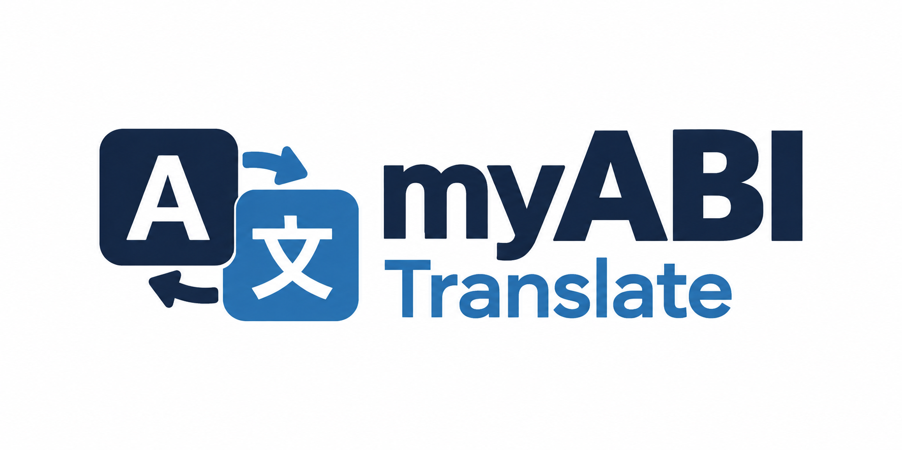

# Logo myABI Translate

Le logo retenu représente la traduction par deux tuiles « A » et « 文 » et deux flèches réciproques. Il est intégré au bandeau commun et aux écrans d’authentification depuis le 23 septembre 2026.

- [Source sur fond blanc](myabi-translate-logo-v2.png).
- [Source à fond transparent](myabi-translate-logo-v2-transparent.png).
- [Variante claire pour le bandeau marine](../../public/images/branding/myabi-translate-header-v2.png).
- [Pictogramme SVG de l’onglet](../../public/favicon.svg), avec glyphes en tracés indépendants des polices.
- [Prompts imagegen](logo-v2.md).

Le cadrage CSS conserve les proportions et masque les marges verticales. Les dimensions sont adaptées aux écrans mobiles. Le nom accessible du lien d’accueil est « myABI Translate ». La favicon utilise une URL versionnée pour actualiser le cache du navigateur.
