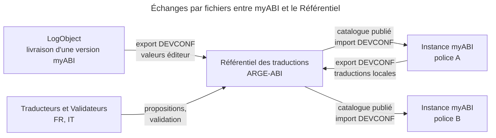
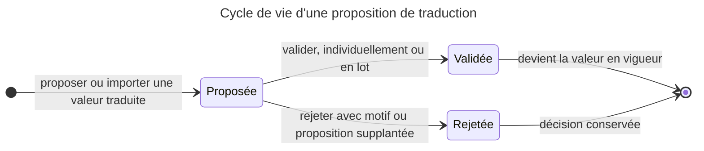
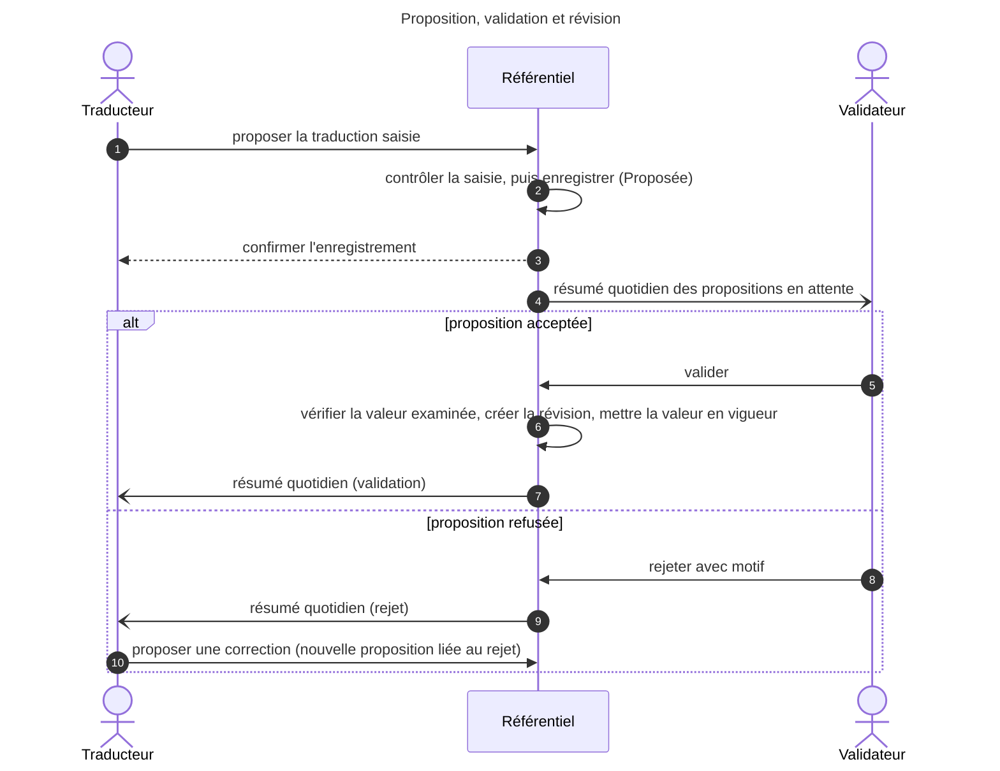
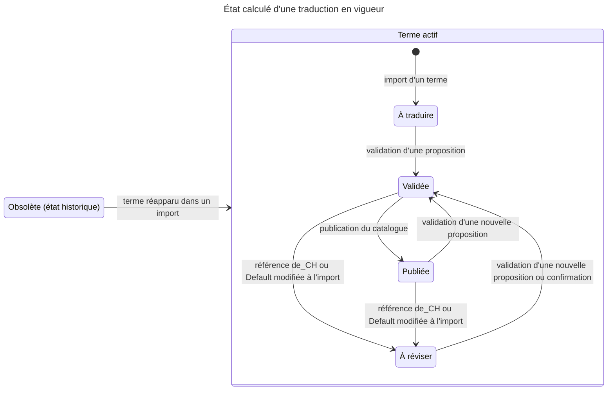
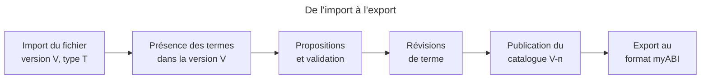
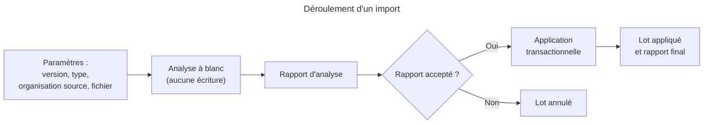
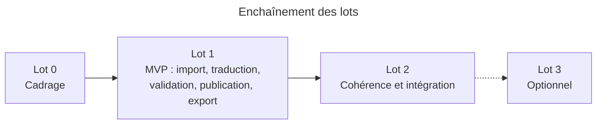

# Spécifications fonctionnelles – Référentiel des traductions ARGE-ABI

| Élément | Valeur |
| --- | --- |
| Version | 1.4 – projet (alignement sur le pilote gratuit) |
| Date | 21.09.2026 |
| Statut | Pour validation par l'ARGE-ABI |
| Objet | Besoins, règles de gestion et périmètre de l'application web de gestion du référentiel des traductions de myABI/icm (LogObject) |
| Document associé | [Spécifications techniques](specifications-techniques-referentiel-traductions-arge-abi.md) : formats de fichier prédéfinis, modèle de données, sécurité, exigences non fonctionnelles, architecture et hébergement |

**Cadrage technique du 21.09.2026** : les [spécifications techniques v3.0](specifications-techniques-referentiel-traductions-arge-abi.md) retiennent Laravel, Blade et MariaDB sur alwaysdata gratuit, pour un pilote d’organisation sans but lucratif, accessible sur Internet. Les sept fichiers restent dans le périmètre ; l’objectif de traitement devient 30 minutes. La [liste des exigences techniques](docs/exigences-techniques.md) reprend les décisions des échanges. Le §9 technique recense les contradictions métier restant à résoudre, notamment collisions, portées, anciennes versions et encodage. Les reports de fonctions proposés en technique v2.0 ne sont pas considérés comme acceptés.

## Sommaire

1. [Contexte et objectifs](#1-contexte-et-objectifs)
2. [Périmètre](#2-périmètre)
3. [Glossaire](#3-glossaire)
4. [Acteurs et rôles](#4-acteurs-et-rôles)
5. [Types de traduction et attributs](#5-types-de-traduction-et-attributs)
6. [Workflow de validation](#6-workflow-de-validation)
7. [Révisions et versions myABI](#7-révisions-et-versions-myabi)
8. [Import myABI](#8-import-myabi)
9. [Export myABI](#9-export-myabi)
10. [Identification et authentification](#10-identification-et-authentification)
11. [Traçabilité et audit](#11-traçabilité-et-audit)
12. [Interface utilisateur web](#12-interface-utilisateur-web)
13. [Exigences complémentaires](#13-exigences-complémentaires)
14. [Lotissement et priorités](#14-lotissement-et-priorités)
15. [Questions ouvertes et décisions à prendre](#15-questions-ouvertes-et-décisions-à-prendre)

## 1. Contexte et objectifs

Le Référentiel des traductions ARGE-ABI (ci-après « le Référentiel ») est l'application web qui centralise, valide et publie les traductions des libellés de myABI/icm pour toutes les polices membres de l'ARGE-ABI.

### Contexte

- myABI/icm (LogObject) est déployé ou en cours de déploiement dans plusieurs polices cantonales suisses.
- L'ARGE-ABI définit des standards uniques pour toutes les polices. Ses membres sont majoritairement germanophones ; les polices romandes et tessinoises dépendent de la qualité des traductions FR et IT.
- myABI sait traduire ses libellés par type (mRic-js, MonoMOT, Server, Form, Incident Workflow, Law Catalog) et gère à part les codes d'incident, invisibles dans l'écran de gestion des traductions.
- L'éditeur livre une traduction par défaut, de portée générale : elle reste trop générique et n'est pas adaptée au vocabulaire ni aux usages du monde de la police. Il n'existe aucun référentiel partagé entre les polices, et aucune validation par les polices latines n'est organisée.

### Objectifs

1. Fournir une source unique et validée des traductions FR et IT (DE restant la langue de référence) pour chaque version de myABI.
2. Organiser un processus de proposition et de validation partagé entre les polices membres.
3. Échanger avec myABI dans ses formats natifs, par import et export, sans ressaisie.
4. Garantir la traçabilité complète (qui, quand, quoi) et un historique par révision de chaque terme.
5. Améliorer la cohérence terminologique : un concept = un terme par contexte, et un terme = un concept par contexte.

**Résultat attendu** : une police qui installe une version de myABI exporte du Référentiel les fichiers de traduction validés pour cette version et les importe dans son instance sans retouche manuelle.

## 2. Périmètre

Le Référentiel gère les libellés des 7 types de traduction myABI, dans les langues de_CH, fr_CH, it_CH et en_US, par échange de fichiers avec myABI.

Le schéma ci-dessous situe le Référentiel entre l'éditeur, les instances myABI des polices et les personnes qui traduisent et valident. Tous les échanges avec myABI passent par des fichiers.

### Dans le périmètre

- Les 6 types visibles dans la gestion des traductions myABI (mRic-js, MonoMOT, Server, Form, Incident Workflow, Law Catalog) et le type Incident code, non visible.
- Les langues de_CH (langue de référence), fr_CH, it_CH, en_US. La colonne technique sa_IN est conservée telle quelle et jamais traduite.
- L'import et l'export dans les formats CSV produits par les exports DEVCONF de myABI, un format par type.
- Le workflow de validation, les révisions de terme, le suivi des versions myABI, la traçabilité et la gestion des comptes.
- La distinction entre éléments communs ARGE-ABI et éléments propres à une police (formulaires ou workflows cantonaux, par exemple préfixés « AG_ »), avec une portée par élément.
- Un glossaire terminologique commun (terme canonique par concept et par langue) servant de référence aux traducteurs (lot 2).

### Hors périmètre

- Connexion directe à la base ou à une API de myABI : l'échange se fait uniquement par fichiers.
- Création ou modification de la structure des objets myABI (nouveaux formulaires, nouveaux codes d'incident, hiérarchie des codes) : seuls les libellés sont gérés, la structure vient de l'import.
- Traduction automatique intégrée (voir lot optionnel en section 14).
- Traduction des modèles de documents de sortie (rapports, courriers) hors des 7 types.

### Hypothèses

- Le format des fichiers d'export DEVCONF est stable pour une version majeure de myABI. Les sept formats connus sont livrés avec l'application ; un changement de format fait l'objet d'une adaptation et de tests par les développeurs avant livraison (section 5 et [annexe des formats](docs/formats-devconf.md)).
- L'allemand est la langue source des libellés métier. La valeur « Default » livrée par l'éditeur est en anglais ou en allemand selon le type.
- Chaque police reste responsable de l'import des fichiers dans sa propre instance myABI.
- Les identifiants techniques des libellés (Name, Cause Id, GROUPTYPE + CODEVALUE, etc.) sont stables entre deux versions de myABI ; un identifiant renommé est traité comme un terme supprimé puis créé.

## 3. Glossaire

Les termes ci-dessous ont un sens précis dans tout le document.

| Terme | Définition |
| --- | --- |
| Type de traduction | Famille de libellés myABI partageant un même format de fichier et un même jeu d'attributs (ex. MonoMOT, Form, Incident code). Chaque type possède une définition de format prédéfinie et versionnée avec l'application : clé d'identité, attributs traduisibles, attributs techniques, format d'import/export. |
| Terme | Unité gérée par le Référentiel : un libellé identifié de manière unique dans un type par sa clé d'identité (ex. Name pour MonoMOT, Form Type + Template + Control + Column pour Form). Un terme porte une ou plusieurs valeurs traduisibles. |
| Clé d'identité | Combinaison d'attributs techniques qui identifie un terme dans myABI. Elle n'est jamais modifiée par le Référentiel. |
| Attribut traduisible | Champ d'un terme qui existe dans plusieurs langues (ex. Cause Text, Short Justification et Legal Remedies pour Law Catalog ; TEXT, SHORTTEXT, ADDINFO pour Incident code). |
| Attribut technique | Champ d'un terme conservé tel quel pour l'export (ex. Active, PHV, SHOWONMOT, CODE_FILL_COLOR). |
| Traduction | Valeur d'un attribut traduisible dans une langue donnée, pour une révision donnée d'un terme. |
| Langue de référence | Langue source à partir de laquelle on traduit : de_CH. |
| Valeur importée | Valeur d'un attribut telle qu'elle figure dans un fichier importé, qu'il provienne de LogObject (valeur éditeur) ou de l'instance d'une police (traduction locale). Elle est rattachée au lot d'import, donc à une version myABI et à une organisation source. |
| Valeur éditeur | Valeur importée d'une livraison LogObject (colonnes Default, Caption ou langue déjà remplie). Une valeur importée traduite est créée comme proposition, jamais comme valeur validée. |
| Révision | État figé et numéroté d'un terme (toutes ses traductions et attributs) à un instant donné. Toute modification validée crée une nouvelle révision ; les anciennes restent consultables. |
| Statut | Position d'une proposition dans le workflow (Proposée, Validée, Rejetée). Les états calculés de la traduction en vigueur (À traduire, Validée, Publiée, À réviser, Obsolète) décrivent sa couverture et sa publication, indépendamment de ce workflow. |
| Version myABI | Numéro de version du logiciel (ex. 2026.2) pour lequel un terme existe. Un terme peut apparaître, changer de valeur éditeur ou disparaître d'une version à l'autre. |
| Catalogue | Ensemble des termes et traductions publiés pour une version myABI et un type donnés, c'est-à-dire ce qui est exportable. |
| Publication | Acte de figer un catalogue pour une version myABI. Une publication porte un numéro (ex. 2026.2-03) et une date. |
| Portée | Indique si un terme est commun à l'ARGE-ABI ou propre à une organisation (canton). |
| Organisation | Police membre de l'ARGE-ABI, ou l'ARGE-ABI elle-même. Chaque utilisateur appartient à une organisation. |
| Concept | Notion métier (ex. « numéro de plaque ») à laquelle on associe un terme canonique par langue dans le glossaire terminologique. Un concept peut être relié à plusieurs termes myABI. |
| Glossaire terminologique | Liste des concepts et de leurs termes canoniques par langue, avec définition et contexte, servant de référence de cohérence. |
| Lot d'import | Un fichier importé, avec sa version myABI, son type, son organisation source, sa date, son auteur et son rapport. |

## 4. Acteurs et rôles

Cinq rôles applicatifs suffisent. Un utilisateur appartient à une organisation et cumule un ou plusieurs rôles, chacun limité à une ou plusieurs langues.

| Rôle | Ce qu'il fait | Qui, typiquement |
| --- | --- | --- |
| Lecteur | Consulte, recherche, compare les révisions, exporte les catalogues publiés. | Tout collaborateur d'une police membre, chef de projet myABI. |
| Traducteur | Propose des traductions dans ses langues, corrige ses propositions en attente, commente (lot 2). | Collaborateur désigné par sa police (FR : polices romandes, IT : police tessinoise). |
| Validateur | Examine les propositions dans ses langues, les valide ou les rejette avec motif, tranche les désaccords terminologiques, gère le glossaire terminologique (lot 2). | Référent linguistique nommé par l'ARGE-ABI, un par langue au minimum. |
| Gestionnaire du Référentiel | Importe les fichiers myABI, crée les versions myABI, publie les catalogues, exporte les publications ou un type de traduction courant pour toute organisation. | Responsable du Référentiel à l'ARGE-ABI, un suppléant. |
| Administrateur | Gère les organisations, les comptes, les rôles, les paramètres système, consulte le journal d'audit. | Exploitant de l'application. |

### Organisations

- L'ARGE-ABI est l'organisation racine ; elle porte les termes de portée commune.
- Chaque police membre est une organisation. Ses utilisateurs voient les termes communs et ceux de leur propre police.
- Un Traducteur ne propose que sur les termes communs et sur ceux de sa police ; un Validateur valide dans ses langues quelle que soit l'organisation propriétaire du terme.

### Matrice des droits

Légende : X = autorisé, L = limité à ses langues, O = limité à son organisation.

| Action | Lecteur | Traducteur | Validateur | Gestionnaire | Administrateur |
| --- | --- | --- | --- | --- | --- |
| Rechercher, consulter, comparer | X | X | X | X | X |
| Exporter un catalogue publié | X | X | X | X | X |
| Exporter simplement un type courant |  |  |  | X |  |
| Proposer une traduction ou corriger une proposition en attente selon la section 6 |  | L, O | L | X |  |
| Valider ou rejeter |  |  | L | X |  |
| Gérer le glossaire terminologique (lot 2) |  |  | L | X |  |
| Importer un fichier myABI |  |  |  | X |  |
| Créer une version myABI, publier un catalogue |  |  |  | X |  |
| Gérer comptes, rôles, organisations |  |  |  |  | X |
| Consulter le journal d'audit complet |  |  |  | X | X |

Le Gestionnaire peut aussi agir comme Validateur pour débloquer une situation ; l'action est alors journalisée avec cette mention.

## 5. Types de traduction et attributs

myABI gère ses libellés en 7 types de traduction, chacun exporté et importé dans son propre fichier DEVCONF. Le Référentiel prend en charge ces sept formats prédéfinis, maintenus et testés avec l'application ; leur détail figure dans l’[annexe des formats](docs/formats-devconf.md).

### Structure de chaque type

Analyse des fichiers DEVCONF du 17.09.2026.

| Type | Fichier | Clé d'identité | Attributs traduisibles |
| --- | --- | --- | --- |
| mRic-js | 01-DEVCONF-NLS-MRIC | Name | 1 (libellé) |
| MonoMOT | 02-DEVCONF-NLS-MONOMOT | Name | 1 (libellé) |
| Server | 03-DEVCONF-NLS-SERVER | Name | 1 (message, souvent avec placeholders `{}` et `{field}`) |
| Form | 04-DEVCONF-NLS-FORM | Form Type + Form Template Name + Control Name + Column Name (label, help_text, watermark, default_value, title) | 1 (valeur de la colonne) |
| Incident Workflow | 05-DEVCONF-NLS-INCIDENTWORKFLOW | Workflow + Control type (Workflow, Node, Link) + Control Name + Column (name, description, label) | 1 (valeur de la colonne) |
| Law Catalog | 06-DEVCONF-NLS-LAWCATALOG | ID# | 3 : Cause Text, Short Justification, Legal Remedies |
| Incident code | 07-DEVCONF-INCIDENTCODE | GROUPTYPE + CODEVALUE + MASTERTYPE + MASTERVALUE | 12 : TEXT, SHORTTEXT, ALTERNATIVE_TEXT_1, ALTERNATIVE_TEXT_2, ADDINFO, ADDINFO1 à ADDINFO6, USAGE_POLICY |

Les six premiers types sont visibles dans la gestion des traductions de myABI ; Incident code ne l'est pas. Les langues gérées sont de_CH (référence), fr_CH, it_CH et en_US ; la colonne technique sa_IN est conservée telle quelle. Les attributs techniques (Active, PHV, SHOWONMOT, dates et auteurs myABI, etc.) sont conservés et réexportés sans modification.

### Volumes et couverture

Mêmes fichiers.

| Type | Lignes de données | fr_CH renseigné | it_CH renseigné | Doublons sans casse | Valeurs multilignes |
| --- | --- | --- | --- | --- | --- |
| mRic-js | 38 562 | 15 566 (40 %) | 13 277 (34 %) | 99 | 132 |
| MonoMOT | 3 867 | 725 (19 %) | 431 (11 %) | 6 | 0 |
| Server | 941 | 289 (31 %) | 102 (11 %) | 2 | 36 |
| Form | 98 974 | 17 595 (18 %) | 13 802 (14 %) | 14 | 1 287 |
| Incident Workflow | 22 830 | 4 585 (20 %) | 5 090 (22 %) | 44 | 0 |
| Law Catalog | 147 | 97 (66 %) | 90 (61 %) | 0 | 50 |
| Incident code | 415 821 | 54 654 (13 %) | 51 195 (12 %) | 15 | 2 075 |

**Précision de l’audit du 21.09.2026** : les nombres de doublons ci-dessus comptent les occurrences après la première lorsque les clés sont comparées sans casse (`casefold`). En comparaison exacte, les six premiers fichiers n’ont aucun doublon et Incident code en a un, avec des valeurs divergentes. La règle d’identité myABI reste à confirmer par LogObject ; ces statistiques ne justifient aucune suppression automatique. Voir l’[audit reproductible](docs/formats-devconf.md#audit-reproductible-du-21092026).

### Constats qui motivent le projet

- Traductions trop génériques : la traduction par défaut emploie un vocabulaire courant, qui ne reflète pas la terminologie policière et procédurale. Un même libellé allemand peut ainsi recevoir plusieurs traductions françaises selon l'écran (551 libellés dans mRic-js, 780 dans les formulaires), et des mots généraux comme « Description » ou « Type » recouvrent des notions que le métier distingue.
- Adaptation au monde de la police : les polices latines ont besoin d'une terminologie commune, propre à leur métier, proposée et validée ensemble plutôt que corrigée séparément dans chaque instance.
- Collisions lorsque la casse est ignorée : 99 occurrences supplémentaires dans mRic-js, 44 dans les workflows et 14 dans les formulaires. Ces clés sont distinctes en comparaison exacte ; leur interprétation dépend de la règle myABI.
- Éléments cantonaux mélangés aux éléments communs : les noms de workflows et de gabarits de formulaire portent des préfixes de canton ou de statut (ZG, LU, SG, AR, AG, GR, AI, PHV, WIP, TEST, OLD).
- Colonne sa_IN employée à un autre usage : elle contient un identifiant technique (par exemple « m00_Exemple », « #12345 ») et non une langue.
- Cause Id du Law Catalog non unique (100 valeurs distinctes pour 147 lignes) : seule la colonne ID# identifie un terme.

### Prise en charge des formats

Chaque format définit les colonnes et leur ordre, la clé d'identité, les attributs traduisibles et leurs langues, la valeur de référence, les attributs techniques à préserver, les règles de portée et de doublons, ainsi que les contrôles de saisie. Les définitions sont versionnées, maintenues par les développeurs et testées sur les fichiers d'exemple. Un nouveau type ou une évolution du format passe par une livraison applicative. L'administration ne comporte pas d'éditeur de formats. Détail : [annexe des formats](docs/formats-devconf.md).

## 6. Workflow de validation

Le workflow s'applique à une proposition de traduction (un terme, un attribut, une langue, une valeur candidate) et comporte trois statuts : **Proposée, Validée, Rejetée**. L'action explicite « Proposer » contrôle la saisie, enregistre la proposition au statut Proposée et la rend immédiatement visible dans la file de validation. La saisie en cours, avant cette action, n'est pas une proposition enregistrée. La valeur en vigueur d'une traduction est toujours la dernière proposition validée ; une proposition en cours ne la remplace jamais avant validation.

Une validation crée une nouvelle révision du terme (section 7). Une proposition rejetée conserve sa valeur, son motif et son historique ; pour la corriger, le traducteur crée une nouvelle proposition liée à celle qui a été rejetée.

La séquence ci-dessous montre les échanges entre le Traducteur, le Référentiel et le Validateur pour une proposition, avec le principe des quatre yeux.

### État de la traduction en vigueur

État d'un triplet terme × attribut × langue, calculé par le système (un seul attribut pour les types NLS, Form et Incident Workflow ; 3 pour Law Catalog ; 12 pour Incident code). Ces indicateurs restent distincts des trois statuts d'une proposition. Le diagramme montre les passages d'un état à l'autre ; le tableau précise leur signification.

| État | Signification | Origine |
| --- | --- | --- |
| À traduire | Aucune valeur validée pour cet attribut dans cette langue. | Import d'un terme sans valeur, ou valeur importée non encore validée. |
| Validée | Une valeur validée existe, pas encore publiée dans un catalogue. | Validation. |
| Publiée | La valeur validée figure dans le dernier catalogue publié de la version myABI. | Publication (section 7). |
| À réviser | La valeur de référence de_CH ou Default a changé dans un import plus récent que la validation ou la confirmation. | Import (nouvelle version myABI ou fichier corrigé) modifiant la référence. |
| Obsolète | État historique d'un terme, conservé pour tous ses attributs et langues jusqu'à sa réapparition dans un import. | Données existantes ; aucun nouvel import ne rend un terme obsolète par son absence dans le fichier. |

### Règles

1. Principe des quatre yeux : l'auteur de la valeur proposée ne peut pas la valider, y compris lorsqu'il a corrigé une proposition issue d'un import. Le Gestionnaire peut déroger ; la dérogation est journalisée.
2. Une valeur validée n'est jamais modifiée en place. Toute correction est une nouvelle proposition, qui produira une nouvelle révision.
3. La validation se fait par langue. Un Validateur ne voit en attente que les propositions de ses langues.
4. Le motif de rejet est obligatoire, choisi dans une liste (terme non conforme au glossaire, sens incorrect, orthographe, longueur, placeholder manquant, supplantée par une autre proposition, autre) et complété par un texte libre.
5. Le Validateur décide directement depuis la file des propositions. Une décision ne porte que sur la valeur qu'il a examinée : si la proposition a été corrigée ou traitée entre-temps, la décision est refusée et la file est actualisée.
6. Validation et rejet en lot sont possibles sur une sélection filtrée (par type, formulaire, workflow, groupe de codes). Depuis la file, « Valider toutes les propositions filtrées » traite aussi les propositions des autres pages ou pas encore chargées, pour la langue et les filtres actifs. Le nombre total est affiché avant confirmation. Le traitement reprend par lots en arrière-plan, sans limite globale de 500 propositions ; les anomalies bloquantes, les propositions personnelles sans dérogation explicite du Gestionnaire et les cellules avec plusieurs propositions concurrentes restent en attente et sont comptabilisées pour examen. Une modification du référentiel interrompt l’opération et exige une nouvelle confirmation ; les validations déjà enregistrées sont conservées.
7. Les valeurs traduites importées arrivent au statut Proposée, jamais en Validée. Le Gestionnaire peut lancer une validation initiale en masse d'un import pour constituer l'état de départ ; l'opération est journalisée comme telle et respecte les contrôles bloquants.
8. Une proposition encore Proposée est corrigeable par son auteur, via une action explicite qui applique les mêmes contrôles que « Proposer » et conserve l'historique des modifications. Une proposition d'import peut être reprise par un Traducteur autorisé pour sa langue et sa portée ; le premier qui la corrige en devient le rédacteur, seul habilité à poursuivre cette correction. Son identité est enregistrée pour le principe des quatre yeux. Une proposition Validée ou Rejetée n'est plus modifiable.
9. Quand une proposition est validée, les autres propositions Proposée sur le même terme, attribut et langue passent à Rejetée avec le motif « supplantée ». Deux propositions concurrentes ne peuvent pas être validées simultanément.
10. Pour une traduction À réviser, le Validateur peut confirmer la valeur en vigueur sans nouvelle proposition ; la confirmation vaut validation (auteur, date et heure) sans changement de valeur ni nouvelle révision.
11. Un contrôle automatique bloque l'envoi d'une proposition vide, contenant un caractère non représentable dans l'encodage d'export ou omettant un placeholder de la source (`{}`, `{field}`, `[Tatbestand]`). Les valeurs importées sont conservées même si elles présentent ces anomalies ; leurs propositions sont signalées dans le rapport et dans la file. Toute validation, y compris en masse, vérifie ces contrôles sur la référence actuelle et exige la correction des anomalies bloquantes.
12. Lot 2 : un contrôle automatique signale (sans bloquer) un écart avec le glossaire terminologique et une traduction identique déjà validée pour la même source ailleurs (suggestion de réutilisation).
13. Lot 2 : chaque proposition porte un fil de commentaires ; un commentaire peut mentionner un utilisateur.
14. Une proposition au statut Proposée sans traitement depuis 30 jours remonte dans le tableau de bord des Validateurs de la langue.

**Notifications** : résumé quotidien par e-mail, désactivable par utilisateur ; aucun envoi immédiat. Validateur : propositions en attente dans ses langues. Traducteur : validations, rejets et mentions (lot 2). Gestionnaire : imports terminés et termes à réviser après import.

## 7. Révisions et versions myABI

Chaque terme a un historique de révisions immuables ; chaque version myABI a ses catalogues publiés, figés et exportables à tout moment.

Un import crée ou met à jour les termes et leur présence dans la version ; la validation produit des révisions ; la publication fige les révisions en vigueur dans un catalogue ; l'export lit un catalogue.

### Révision de terme

- Une révision est une photo complète d'un terme : tous ses attributs traduisibles dans toutes les langues, ses attributs techniques et ses métadonnées.
- La révision 1 est créée au premier import du terme. Chaque validation d'une proposition et chaque import qui modifie le terme créent la révision suivante (numéro entier croissant par terme).
- Une révision porte : numéro, date et heure, auteur, origine (lot d'import ou proposition validée), version myABI concernée, différence avec la révision précédente.
- Une révision n'est jamais modifiée ni supprimée. Revenir en arrière = créer une nouvelle proposition préremplie avec les valeurs d'une ancienne révision, qui suit le workflow normal.
- L'écran du terme affiche la liste des révisions et permet la comparaison côte à côte de deux révisions, attribut par attribut et langue par langue.

### Version myABI

- Une version est créée par le Gestionnaire avec son numéro tel que défini par LogObject (par exemple 2026.2), sa date de sortie et son statut : En préparation, Courante, Archivée. Une seule version est Courante.
- Chaque lot d'import est rattaché à une version, à un type et à une organisation source. La présence d'un terme dans une version est enregistrée par lot, avec les valeurs constatées dans le fichier.
- Le Référentiel maintient une seule valeur en vigueur par terme, attribut et langue, alignée sur la version la plus récente importée. Si la valeur de référence de_CH ou Default d'un attribut change entre deux versions, sa traduction passe à l'état À réviser (section 6) et l'ancienne valeur reste visible dans l'historique.
- Les catalogues publiés pour une version antérieure restent figés. Une police qui reste sur cette version exporte toujours le même fichier.
- La maintenance parallèle de deux versions (traductions différentes pour un même terme selon la version) n'est pas prévue ; voir question ouverte en section 15.

### Publication d'un catalogue

1. Le Gestionnaire choisit une version et un ou plusieurs types ; le système affiche le nombre de termes par état (Validée, À traduire, À réviser) par langue.
2. La publication fige, pour chaque terme ayant une présence dans la version (y compris les termes portant l'état historique Obsolète), la révision en vigueur à cet instant. Les attributs et langues sans valeur validée ne reçoivent aucune valeur du Référentiel : l'export y place la valeur de repli importée (section 9) ; l'export ne fabrique jamais de valeur.
3. La publication enregistre, par type et par organisation, le dernier lot appliqué pour la version depuis l'instance de cette organisation, qui servira de lot de repli à l'export ; à défaut, le dernier lot LogObject. Tous les lots appliqués, anciens ou nouveaux, sont éligibles selon les mêmes règles : leur intégrité et leur couverture réelle des termes actifs de la version sont vérifiées, sans classement du lot par mode d'import. Les blocages techniques de la section 9 des spécifications techniques restent applicables. Elle fige aussi la version de la définition de chaque format utilisée pour l'export. Les révisions, lots de repli et définitions de format retenus restent disponibles pour reproduire ses fichiers après une évolution de l'application.
4. La publication reçoit un numéro composé du numéro de version myABI et d'une séquence (2026.2-03), une date et heure, un auteur et une note de publication libre.
5. Une publication est immuable. Elle peut être marquée Retirée avec un motif ; elle reste consultable mais n'est plus proposée par défaut à l'export.
6. Un rapport de publication liste, par type et par langue, les termes publiés, ceux restés en valeur de repli et les différences avec la publication précédente de la même version.

## 8. Import myABI

L'import lit un fichier d'export DEVCONF, le compare à l'état du Référentiel et n'applique les changements qu'après un rapport d'analyse accepté par le Gestionnaire. Un seul mode d'import s'applique à tous les fichiers : les lignes présentes alimentent le Référentiel, sans retirer ni rendre obsolètes les termes absents du fichier. Rien n'est validé automatiquement.

L'analyse à blanc ne modifie rien ; l'application est tout ou rien.

### Paramètres d'un import

- Version myABI : existante, ou créée à la volée (statut En préparation).
- Type : détecté à partir de l'en-tête du fichier et des sept formats pris en charge, confirmé par l'utilisateur ; la version de la définition de format utilisée est conservée avec le lot.
- Organisation source : la police dont provient l'export (ou l'éditeur pour une livraison LogObject).
- Pilote : prise en charge des sept fichiers complets, dont Incident code d’environ 72 Mo, avec traitement asynchrone et progression. Objectif de recette retenu : jusqu’à 30 minutes de traitement serveur pour l’ensemble, analyse et application comprises, avec consultation maintenue ; transfert et attente de validation humaine mesurés séparément. L’ancienne cible de croissance de 250 Mo et 1 500 000 lignes par fichier reste un besoin à réévaluer, sans capacité garantie sur l’offre gratuite.

### Contrôles de l'analyse

Bloquants sauf mention contraire.

1. Encodage conforme au format du type ; un fichier UTF-8 avec BOM ou des séquences UTF-8 valides déclenche un avertissement et une conversion proposée.
2. En-tête identique à la liste de colonnes du format (noms et ordre) ; nombre de colonnes constant par ligne.
3. Clé d'identité non vide (sauf colonnes autorisées vides).
4. Doublons de clé dans le fichier : traités selon la règle du type (refus, première ligne, dernière ligne), toujours listés dans le rapport avec leur numéro de ligne ; les lignes écartées ne sont pas réexportées (section 9).
5. Empreinte SHA-256 déjà importée pour la même version et le même type : avertissement non bloquant « fichier déjà traité », l'utilisateur confirme pour poursuivre.
6. Caractères non représentables dans l'encodage d'export (possibles seulement après conversion d'un fichier UTF-8) : avertissement, la valeur est importée telle quelle ; sa proposition doit être corrigée avant validation. Si la valeur importée est utilisée comme repli, la règle de substitution de la section 9 s'applique à l'export.
7. Placeholders manquants dans une traduction importée : avertissement dans le rapport et sur la proposition ; la valeur d'origine est conservée et la proposition doit être corrigée avant validation. Une cellule de traduction vide ne crée pas de proposition.

### Classement de chaque ligne

Chaque ligne est comparée à la révision courante du terme. Les colonnes de traçabilité myABI (Create Time, Create User, Update Time, Update User, Create Dt, Update Dt, UpdateUser, UpdateDt, CREATETIME, CREATEUSER, UPDATE_DT, UPDATE_USER) sont conservées dans la présence mais exclues de la comparaison : elles diffèrent d'une instance à l'autre et ne créent jamais de révision.

| Cas | Effet |
| --- | --- |
| Clé inconnue | Terme créé, révision 1, présence dans la version ; portée proposée par la règle du type. Les valeurs traduites non vides du fichier deviennent des propositions au statut Proposée. |
| Clé connue, aucune différence | Présence dans la version enregistrée pour ce lot, rien d'autre. |
| Valeur de référence (de_CH, sinon Default) d'un attribut modifiée | Nouvelle révision d'origine import ; les traductions validées de cet attribut passent À réviser. |
| Attribut technique modifié (Active, PHV, VALIDTODT, etc.) | Nouvelle révision d'origine import ; aucune action de workflow. |
| Valeur traduite non vide présente dans le fichier, absente du Référentiel | Proposition au statut Proposée, auteur = compte import, organisation = source. |
| Valeur traduite identique à une proposition d'import encore Proposée | Rien ; la proposition existante est aussi rattachée à ce lot. |
| Valeur traduite différente d'une proposition d'import encore Proposée, sans valeur validée | Proposition supplémentaire au statut Proposée avec son organisation source ; les propositions concurrentes s'affichent côte à côte dans la vue de traduction. |
| Valeur traduite non vide différente de la valeur validée | Proposition au statut Proposée marquée « divergence avec l'instance de [organisation] » ; la valeur validée reste en vigueur. Une proposition d'import identique encore en attente est rattachée au lot sans duplication. |
| Valeur traduite identique à la valeur validée | Rien. |
| Terme connu absent du fichier | Aucune présence créée pour ce lot ; l'état du terme, ses présences antérieures, ses valeurs et son historique sont conservés. |
| Terme historiquement Obsolète présent dans le fichier | Le terme redevient actif ; les valeurs du fichier suivent les mêmes règles de comparaison et de proposition que les autres lignes. |

### Rapport d'import

- Comptes par catégorie : créés, inchangés, référence modifiée, techniques modifiés, propositions créées, divergences, doublons, erreurs.
- Liste détaillée téléchargeable (CSV) avec numéro de ligne, clé, catégorie, message.
- Le rapport est conservé avec le lot et consultable depuis l'historique des imports.

**Validation initiale en masse** : pour constituer l'état de départ, le Gestionnaire peut, après un import, valider en une opération les propositions encore Proposée d'un lot pour une langue donnée. L'opération exclut les propositions marquées divergence ou présentant une anomalie bloquante ; l'aperçu et le rapport indiquent les exclusions. Pour un même terme, attribut et langue, une seule proposition peut être retenue, les concurrentes étant rejetées comme supplantées. Les contrôles et le principe des quatre yeux de la section 6 s'appliquent, avec dérogation journalisée du Gestionnaire le cas échéant. L'opération est journalisée comme validation en masse avec le lot comme origine.

**Annulation** : l'analyse à blanc est la protection principale. Un lot appliqué ne s'annule pas en MVP ; l'annulation d'un lot sans validation postérieure sur les termes touchés est prévue en lot 2 (section 14).

## 9. Export myABI

Le menu Publications permet de télécharger une publication complète pour une organisation destinataire : un fichier par type présent dans la publication, avec toutes ses lignes et toutes ses langues. Le menu Exports permet au Gestionnaire de télécharger directement un seul type courant. Chaque fichier est strictement conforme au format d'import de myABI : mêmes colonnes, même ordre, même encodage, mêmes guillemets. Un fichier importé puis publié et exporté sans changement est identique octet pour octet, à la seule exception des lignes en doublon écartées à l'import selon la règle du type et listées dans le rapport (section 8) ; ce test automatique est exécuté pour chaque type à chaque livraison du Référentiel. Le sort définitif des doublons dépend des réponses aux questions 4 et 5 (section 15).

### Export simple d'un type

Le menu **Exports**, accessible au Gestionnaire, permet de choisir un type de traduction, une version admissible et une organisation destinataire active, puis de télécharger directement son fichier CSV DEVCONF. Les sept types sont proposés, avec toutes les langues du fichier. La version doit disposer d'un import appliqué, ne pas être archivée et ne pas précéder la dernière version ayant un import appliqué.

L'export utilise la révision courante validée et conserve les valeurs source de repli pour les cellules sans traduction validée. Il privilégie le dernier import appliqué de l'organisation pour ce type et cette version, puis l'import éditeur à défaut. Les propositions en attente ne remplacent aucune cellule. Les contrôles d'intégrité, d'identité, de portée, de couverture et d'encodage restent ceux des publications ; une anomalie bloquante empêche le téléchargement.

Cette action ne crée aucune publication, ne valide aucune proposition et ne modifie pas l'état publié des termes. Le nom du fichier correspond au nom DEVCONF du type. Le fichier est généré en stockage privé temporaire, puis supprimé après envoi. L'action est journalisée avec l'utilisateur, la version, le type, l'organisation, la source, la version du format, le nombre de lignes et les empreintes SHA-256. Un nouvel export reflète les validations et imports intervenus depuis le précédent ; les publications restent le moyen de conserver un catalogue figé.

### Téléchargement d'une publication

- L'utilisateur ouvre une publication dans la version myABI concernée puis la télécharge ; la dernière publication Active de la version Courante est proposée par défaut.
- L'organisation destinataire est celle de l'utilisateur. Le Gestionnaire peut télécharger pour une autre organisation. Ce contexte détermine le lot de repli figé par la publication et le code dans le nom de fichier.
- Le téléchargement inclut tous les types de la publication, regroupés dans une archive ZIP s'il y en a plusieurs. Toutes les langues et toutes les lignes du catalogue sont incluses, quelle que soit leur portée, afin de ne rien supprimer dans l'instance destinataire tant que la question 3 (section 15) n'est pas tranchée.
- Le téléchargement d'une publication ne comporte pas de sélection de types, de langues, de portée ou de mode. Le menu Exports offre séparément l'export simple d'un type décrit ci-dessus. Les filtres de consultation et les sélections dans la vue de traduction ne modifient jamais le contenu téléchargé.

### Contenu de chaque fichier

| Élément | Règle |
| --- | --- |
| Lot de repli | Lot retenu et figé par la publication (section 7) pour le type et l'organisation destinataire : dernier lot appliqué depuis son instance pour la version, sinon dernier lot LogObject, à la date de publication. Toutes les « valeurs importées » ci-dessous en proviennent. |
| Lignes | Tous les termes retenus dans la publication ayant une présence dans la version, indépendamment de leur état global Actif ou Obsolète et de leur portée. Ordre des lignes identique au lot de repli, nouveaux termes en fin. |
| Colonnes | Noms et ordre de la définition du format dont la version est figée par la publication. |
| Colonnes traduites | Valeur validée figée dans la publication. Sans valeur validée : valeur importée, inchangée. |
| Colonne de référence de_CH, Default, Caption | Valeur importée, sauf si une correction de l'allemand a été validée et figée dans la publication. |
| Colonnes techniques | Valeur importée, telle quelle, y compris les colonnes Update User et Update Dt. |
| Colonne sa_IN | Valeur importée, jamais modifiée. |
| Valeurs multilignes, espaces, placeholders | Préservés à l'identique. |
| Encodage, séparateur, guillemets, fins de ligne | Selon la définition du format figée par la publication (Windows-1252, point-virgule, CRLF, guillemets partout ou si nécessaire). |

**Nom des fichiers** : nom d'origine du type (par exemple 04-DEVCONF-NLS-FORM), suivi de la version, du numéro de publication et du code d'organisation : `04-DEVCONF-NLS-FORM_2026.2-03_VD.csv`.

### Règles complémentaires

1. Les caractères non représentables dans Windows-1252 sont refusés lors de l'envoi d'une proposition et avant sa validation pour les types exportés dans cet encodage. Un tel caractère provenant d'une valeur importée utilisée comme repli (section 8, contrôle 6) est remplacé par « ? » à l'export et listé dans le journal d'export ; l'export n'échoue jamais pour cette raison.
2. Chaque export est journalisé : utilisateur, date et heure, version myABI, publication le cas échéant, types inclus, organisation, lots de repli, versions des formats, nombre de lignes par fichier, empreinte SHA-256 de chaque fichier.
3. Un export de publication est reproductible : deux téléchargements de la même publication pour la même organisation donnent des fichiers CSV identiques, même après de nouveaux imports ou une mise à jour de l'application.
4. Un échange de révision (XLSX) destiné aux Validateurs non techniques est fourni en lot 2 : clé, référence, valeur en vigueur, proposition, commentaire ; sa réimportation crée des propositions au statut Proposée, soumises aux mêmes contrôles. Cette fonction de révision est distincte de l'export DEVCONF vers myABI.

**Processus côté police** : télécharger l'archive, importer chaque fichier dans myABI par la fonction d'import DEVCONF correspondante, vérifier dans la gestion des traductions. Ce processus est documenté dans l'aide en ligne du Référentiel.

## 10. Identification et authentification

Chaque utilisateur a un compte nominatif rattaché à une organisation. Le MVP authentifie localement avec un second facteur piloté par la configuration du serveur ; la fédération avec les annuaires des polices vient en lot 2.

### Comptes

- Création par l'Administrateur : identifiant (adresse e-mail professionnelle), nom, prénom, organisation, rôles et langues. Aucun compte partagé.
- Invitation par e-mail avec lien à usage unique valable 72 heures ; l'utilisateur définit son mot de passe et enregistre son second facteur à la première connexion si le MFA est activé sur le serveur et requis pour son rôle.
- Alternative dans l'administration : activation sans e-mail, à la création ou pour un compte existant, avec définition et confirmation d'un mot de passe d'au moins 8 caractères par défaut, selon `AUTH_PASSWORD_MIN_LENGTH`, par l'Administrateur. L'action est auditée, invalide les invitations et liens de récupération précédents, révoque les sessions et conserve l'obligation de second facteur selon les rôles lorsque le MFA est activé sur le serveur. Elle ne constitue pas une vérification de l'adresse e-mail.
- Désactivation (jamais suppression) : l'historique et les auteurs restent lisibles. Réactivation possible. Anonymisation du compte à l'issue du délai de conservation (section 11).
- Un compte technique « import », non connectable, est l'auteur des propositions créées par import.

### Authentification

- MVP : mot de passe (8 caractères minimum par défaut, longueur réglable par `AUTH_PASSWORD_MIN_LENGTH=8` dans `.env` pour tous les parcours de définition ou de modification, sans expiration périodique) ; second facteur TOTP désactivé par défaut pour tout le serveur via `MFA_ENABLED=false` dans `.env`. Avec `false`, aucun compte n'a de défi ni d'obligation de configuration MFA, et les secrets existants sont conservés. Avec `true`, le TOTP est obligatoire pour Validateur, Gestionnaire et Administrateur, facultatif pour les autres ; tous les comptes l'ayant confirmé doivent le fournir à la connexion. Lors d'une réactivation, les comptes déjà configurés dont la session a été ouverte sans MFA doivent se reconnecter ; les comptes soumis à l'obligation et non encore configurés sont dirigés vers leur profil. Le réglage est exclusivement serveur, sans commande d'administration dans l'interface.
- Verrouillage temporaire après échecs répétés ; réinitialisation par lien e-mail à usage unique ; session expirée après 60 minutes d'inactivité et 12 heures au maximum ; l'Administrateur peut déverrouiller un compte et révoquer ses sessions.
- Lot 2 : fédération OpenID Connect avec l'annuaire de chaque organisation (un fournisseur d'identité par organisation, groupes de l'annuaire associés aux rôles du Référentiel, compte créé à la première connexion) ; l'authentification locale reste disponible pour les organisations sans annuaire compatible.
- Mécanismes détaillés : spécifications techniques, section 6.

### Autorisation

- Contrôle côté serveur à chaque requête selon la matrice de la section 4, avec le périmètre langues et organisation.
- L'interface masque les actions non autorisées ; le serveur les refuse quand même.
- Les changements de rôle prennent effet à la requête suivante, sans reconnexion.

**Données personnelles** : nom, prénom, e-mail, organisation et journal des actions des utilisateurs (adresse IP comprise) ; identifiants de collaborateurs figurant dans les colonnes Create User et Update User des fichiers myABI (abréviations de quelques lettres, par exemple « abcd »), conservés comme traçabilité d'origine (section 11). Le Référentiel ne contient en revanche aucune donnée opérationnelle de police : uniquement des libellés d'interface, des listes de codes et des textes procéduraux. Ce constat guide la classification de l'hébergement (spécifications techniques, section 8) et doit être confirmé par le responsable de la protection des données de l'ARGE-ABI.

## 11. Traçabilité et audit

Toute donnée répond à quatre questions : créée quand, par qui, modifiée quand, par qui. Toute action qui change l'état du Référentiel est en plus inscrite dans un journal d'audit inaltérable.

### Champs de traçabilité

Sur chaque entité métier enregistrée par le Référentiel (spécifications techniques, section 4). Les définitions de format, livrées avec le code, sont tracées par leur version et l'historique des livraisons.

| Champ | Contenu |
| --- | --- |
| Créé le | Date et heure UTC à la seconde, affichée en heure suisse. |
| Créé par | Utilisateur du Référentiel ou compte technique import (avec le lot). |
| Modifié le | Date et heure de la dernière modification ; égale à Créé le tant qu'aucune modification n'a eu lieu. |
| Modifié par | Auteur de la dernière modification. |

Ces champs sont affichés sur chaque fiche (terme, proposition, révision, publication, lot, utilisateur) et disponibles dans les rapports d'audit.

### Journal d'audit

- Une entrée par action : connexion réussie ou échouée, création et correction de proposition, validation, rejet, validation en masse, import (analyse et application), publication, retrait de publication, export, création ou modification d'un compte, changement de rôle, dérogation au principe des quatre yeux. Les versions des formats utilisées sont conservées avec les imports et publications.
- Contenu : date et heure, utilisateur, organisation, action, entité et identifiant, valeurs avant et après, adresse IP, identifiant de requête.
- Le journal est en ajout seul : aucune modification ni suppression par l'application, y compris par l'Administrateur. Mécanisme de base de données : spécifications techniques, section 6.
- Consultation par le Gestionnaire et l'Administrateur : filtres par période, utilisateur, action, entité ; export CSV.
- Chaque utilisateur voit ses propres actions dans son profil.

**Historique lisible par terme** : la fiche d'un terme présente une chronologie unique mêlant imports, propositions, décisions, commentaires, révisions et publications, du plus récent au plus ancien, avec l'auteur et l'organisation de chaque événement.

**Données éditeur** : les colonnes Create User, Create Time, Update User et Update Time des fichiers myABI sont conservées dans la présence dans version et affichées comme « traçabilité d'origine myABI », distincte de celle du Référentiel.

**Conservation** : journal d'audit et révisions conservés sans limite de durée pendant la vie du Référentiel. Un compte désactivé est anonymisé à l'issue d'un délai à fixer par l'ARGE-ABI (proposition : 10 ans, aligné sur les exigences d'archivage cantonales les plus strictes) : nom, prénom et e-mail sont remplacés par un identifiant neutre, l'historique et le journal restent intacts.

## 12. Interface utilisateur web

L'interface est une application web en allemand, français et italien, conçue pour traiter des milliers de libellés au clavier : la vue de traduction et la file de validation sont les deux écrans où les utilisateurs passent leur temps.

### Écrans

| Écran | Contenu | Rôles |
| --- | --- | --- |
| Tableau de bord | Pour le Validateur : propositions en attente par langue et type, propositions en retard. Pour le Traducteur : termes À traduire et À réviser par type, rejets à corriger. Pour le Gestionnaire : version courante, derniers imports, couverture par type et langue, publication prête ou non. | Tous |
| Recherche et liste des termes | Filtres : type, version, langue, état, portée et organisation, formulaire, workflow ou groupe de codes, texte libre sur clé, référence et traductions. Tri, pagination serveur, colonnes configurables, sélection multiple pour les actions en lot. | Tous |
| Fiche terme | Clé, type, portée, présence par version et par lot ; grille attribut × langue avec valeur en vigueur, état et proposition en cours ; actions proposer, corriger une proposition en attente, valider, rejeter, confirmer ; chronologie ; révisions et comparaison ; en lot 2 : commentaires, concept lié, termes ayant la même référence ailleurs. | Tous, actions selon rôle |
| Vue de traduction | Tableau : clé, référence de_CH, valeur en vigueur, saisie éditable en ligne, proposition en attente et statut. Filtre « à traduire seulement ». Navigation clavier, action explicite « Proposer », individuellement ou en lot, avec contrôles avant envoi ; correction des propositions encore en attente selon la section 6. | Traducteur, Validateur, Gestionnaire |
| File de validation | Propositions au statut Proposée de mes langues ; référence, valeur en vigueur et proposition côte à côte, différences surlignées et anomalies bloquantes ; valider ou rejeter avec motif, individuellement ou en lot. | Validateur, Gestionnaire |
| Imports | Liste des lots avec statut et rapport ; assistant en trois étapes (paramètres, analyse, application). | Gestionnaire |
| Versions et publications | Versions avec statut ; couverture par type et langue ; publication ; liste des publications avec export. | Gestionnaire (lecture pour tous) |
| Téléchargement d'une publication | Depuis la publication choisie, téléchargement complet pour l'organisation de l'utilisateur ; le Gestionnaire peut choisir l'organisation destinataire. | Tous selon droits |
| Glossaire terminologique (lot 2) | Concepts, termes canoniques par langue, synonymes proscrits, définition, domaine, termes myABI liés ; recherche. | Lecture pour tous, édition Validateur et Gestionnaire |
| Administration | Organisations, utilisateurs, rôles, paramètres système. | Administrateur |
| Profil | Langue d'interface, notifications, second facteur si activé sur le serveur (sinon statut désactivé), mes actions. | Tous |

### Aides à la saisie dans la vue de traduction

- Lot 2 : suggestion automatique des traductions déjà validées pour une référence identique ou proche (mémoire de traduction interne), avec le nombre d'occurrences ; reprise en un clic.
- Lot 2 : terme canonique du glossaire affiché lorsque la référence contient un concept connu ; avertissement si la proposition utilise un synonyme proscrit.
- Placeholders de la référence surlignés et comptés ; blocage de l'action « Proposer » s'ils manquent.
- Compteur de longueur et avertissement au-delà de la longueur maximale définie pour l'attribut.
- Contexte : pour Form et Incident Workflow, le gabarit ou le workflow parent et les libellés voisins ; pour Incident code, le groupe et le code parent (MASTERTYPE, MASTERVALUE).

### Règles transversales

1. Langues d'interface : allemand (par défaut), français, italien ; anglais en option. Les libellés de l'interface sont eux-mêmes gérés dans des fichiers de ressources et traduits avant livraison.
2. Accessibilité : WCAG 2.1 niveau AA, conformément au standard eCH-0059 ; navigation complète au clavier.
3. Navigateurs : versions courantes de Edge, Chrome et Firefox ; écran de 1366 px de large au minimum ; pas d'exigence mobile.
4. Toute liste est paginée côté serveur et filtrable ; les filtres sont conservés dans l'URL pour être partagés.
5. Chaque action en lot affiche le nombre d'éléments touchés et demande confirmation.
6. Une saisie non envoyée est clairement distinguée d'une proposition enregistrée ; quitter une saisie non envoyée déclenche un avertissement. Une éventuelle récupération de saisie après interruption ne l'envoie jamais automatiquement à la validation.

## 13. Exigences complémentaires

Au-delà du stockage et du workflow, le Référentiel doit rendre visibles et corrigeables les écarts constatés en section 5 : plusieurs traductions pour un même libellé, termes génériques recouvrant plusieurs notions et vocabulaire non adapté au métier policier. Sauf la recherche, livrée avec le MVP, les fonctions de cette section relèvent du lot 2 (section 14).

### Glossaire terminologique et décisions

- Un concept porte : code, définition, domaine (personne, véhicule, objet, procédure, organisation, interface), terme canonique par langue, synonymes proscrits par langue, exemples, statut (Proposé, Validé), et la liste des termes myABI qui lui sont liés.
- Une décision terminologique enregistre un choix de l'ARGE-ABI : concept, termes retenus, motif, date, séance ou groupe de travail, auteur. Les décisions sont listées chronologiquement et liées au concept ; elles constituent la mémoire de l'association.
- Les homonymes (un mot, plusieurs sens) sont séparés en concepts distincts, distingués par leur domaine et leur définition ; le lien terme–concept lève l'ambiguïté pour chaque libellé myABI.
- Un terme myABI peut être lié à un concept manuellement ou par proposition automatique (référence identique au terme canonique de_CH d'un concept).

### Rapports de cohérence

Calculés chaque nuit, consultables à tout moment, filtrables par type, langue, version et organisation.

| Rapport | Détecte | Action proposée |
| --- | --- | --- |
| Une référence, plusieurs traductions | Références de_CH identiques (casse et ponctuation finale ignorées) traduites différemment, dans un type et entre types. | Choisir la valeur cible puis confirmer l'envoi ; le système applique les contrôles et crée une proposition au statut Proposée pour chaque autre terme conforme, avec un rapport des exclusions (unification en masse). |
| Une traduction, plusieurs références | Traductions identiques pour des références différentes (homonymie potentielle). | Lier à des concepts distincts ou reformuler. |
| Traduction égale à la référence | Allemand recopié dans une autre langue. | Passer à À traduire. |
| Valeurs suspectes | Chiffres accolés (« créer7 »), points d'interrogation entre parenthèses, mots TODO, WIP, TEST, XXX, espaces doubles, espaces de fin. | Corriger ou confirmer comme voulu (exclusion mémorisée). |
| Placeholders | Placeholders absents ou en trop par rapport à la référence. | Corriger. |
| Écarts au glossaire | Synonyme proscrit utilisé, terme canonique absent. | Corriger ou faire évoluer le glossaire. |
| Couverture | Part des termes validés par type, langue, version, formulaire, workflow, groupe de codes. | Planifier le travail de traduction. |
| Longueur | Traduction plus de deux fois plus longue que la référence ou au-delà de la longueur maximale définie pour l'attribut. | Vérifier l'affichage dans myABI. |

### Recherche

- Plein texte insensible à la casse et aux accents sur la clé, la référence, toutes les traductions et les commentaires ; recherche exacte entre guillemets ; recherche par début de clé.
- Résultats groupés par type avec le nombre par type ; ouverture directe de la vue de traduction sur le résultat filtré.
- Expressions régulières réservées au Gestionnaire (analyse de masse).

**Mémoire de traduction interne** : pour toute référence, le système connaît les traductions validées ailleurs et leur fréquence. Action « appliquer à tous les termes de même référence » depuis une proposition, avec aperçu du nombre de termes touchés ; les propositions créées suivent le workflow normal.

### Commentaires et étiquettes

- Fil de commentaires sur chaque terme et chaque proposition, mentions d'utilisateurs, marquage « résolu ».
- Étiquettes libres sur les termes (par exemple « à discuter en séance », « attente LogObject »), filtrables, gérées par le Gestionnaire.

**Aide intégrée** : guide de traduction de l'ARGE-ABI (règles de style par langue, usage du tutoiement et du vouvoiement, abréviations), accessible depuis chaque écran de saisie et maintenu par les Validateurs.

## 14. Lotissement et priorités

Le MVP couvre le cycle complet import, traduction, validation, publication, export pour les 7 types ; les aides à la cohérence et la fédération d'identité suivent en lot 2.

| Lot | Contenu | Critère de fin |
| --- | --- | --- |
| 0. Cadrage | Validation de ces spécifications par l'ARGE-ABI, réponses aux questions de la section 15, choix de l'hébergement et du prestataire, confirmation des formats DEVCONF avec LogObject, fourniture d'un jeu de fichiers par version myABI ciblée, mise à disposition par une police membre d'une instance myABI de test pour le critère d'acceptation 3. | Spécifications signées, environnement de test du Référentiel et instance myABI de test disponibles. |
| 1. MVP | Comptes locaux avec second facteur configurable sur le serveur, désactivé par défaut ; organisations et rôles ; prise en charge des 7 formats prédéfinis ; import avec analyse à blanc et rapport ; termes, révisions, présence par version ; vue de traduction et fiche terme avec historique ; workflow Proposée, Validée, Rejetée et validation initiale en masse ; versions, publications, téléchargement des publications complètes ; recherche ; journal d'audit ; notifications par e-mail ; interface DE, FR, IT ; documentation. | Critères d'acceptation ci-dessous atteints en environnement de test. |
| 2. Cohérence et intégration | Fédération OpenID Connect par organisation ; glossaire terminologique et décisions ; rapports de cohérence et unification en masse ; mémoire de traduction et suggestions ; commentaires avec mentions, étiquettes ; export et réimport XLSX de révision ; annulation d'un lot d'import ; tableau de bord enrichi. | Rapports de cohérence validés par les Validateurs FR et IT sur les données réelles. |
| 3. Optionnel | Aide à la traduction automatique (moteur hébergé en Suisse, suggestions uniquement, jamais validées automatiquement) ; API REST pour les outils des polices ; maintenance parallèle de plusieurs versions myABI ; ouverture aux polices municipales. | Décision de l'ARGE-ABI après six mois d'exploitation. |

### Critères d'acceptation du MVP

1. Les 7 fichiers d'exemple s'importent sans erreur bloquante et, après publication sans modification des valeurs, se réexportent à l'identique octet pour octet, hors lignes en doublon écartées à l'import et listées dans le rapport.
2. Le traitement serveur des sept fichiers complets, dont Incident code d’environ 72 Mo, s’exécute en 30 minutes maximum dans le pilote, analyse et application comprises, avec consultation et progression disponibles. Le transfert et l’attente humaine sont mesurés séparément ; la capacité est testée lors de l’import initial puis d’un réimport de l’ensemble des sept fichiers.
3. Un fichier exporté après validation de 100 traductions françaises s'importe dans une instance de test myABI et les libellés validés s'affichent correctement.
4. Un Validateur traite 500 propositions en une session sans quitter la file de validation.
5. Chaque action de la matrice des droits est refusée par le serveur pour un rôle non autorisé (tests automatisés).
6. Toute entité métier affiche ses quatre champs de traçabilité et toute action figure dans le journal d'audit ; les versions de format sont identifiables pour chaque import et publication.
7. Une restauration complète depuis une sauvegarde est réalisée et documentée avant la mise en production.
8. Une proposition envoyée ou importée apparaît au statut Proposée ; la valeur en vigueur reste inchangée jusqu'à validation. Un rejet conserve son motif et sa valeur ; sa correction crée une nouvelle proposition liée. Les contrôles bloquent aussi une validation en masse non conforme et une décision portant sur une valeur modifiée entre-temps.
9. Le téléchargement contient tous les types, lignes et langues de la publication pour l'organisation destinataire. Après de nouveaux imports et une évolution d'un format, les fichiers CSV d'une publication existante restent identiques.

**Priorités en cas d'arbitrage** : conformité des formats d'export, puis workflow et traçabilité, puis performance de la vue de traduction, puis le reste. Aucune fonctionnalité ne justifie un export non conforme.

## 15. Questions ouvertes et décisions à prendre

Quatorze questions restent à trancher avant le démarrage du lot 1 ; sept relèvent de LogObject et sept de l'ARGE-ABI.

| N° | Question | Impact si non tranchée | À trancher par |
| --- | --- | --- | --- |
| 1 | Que fait myABI quand fr_CH est vide : affiche-t-il Caption, Default ou la clé ? | Détermine si l'export peut laisser des colonnes vides ou doit recopier une valeur de repli. | LogObject |
| 2 | Que contient la colonne sa_IN (identifiant technique ?) et doit-elle être réexportée telle quelle ? | Règle d'export de la colonne. | LogObject |
| 3 | L'import DEVCONF de myABI écrase-t-il toutes les colonnes, y compris Update User et Update Time ? Supprime-t-il les lignes absentes du fichier ? | Règle des colonnes techniques à l'export ; risque de perte de libellés cantonaux. | LogObject |
| 4 | Les clés sont-elles sensibles à la casse dans myABI (« Weiter » et « weiter » coexistent dans un même workflow) ? Comment sont traitées les 99 collisions de Name de mRic-js si la casse est ignorée, alors que les clés exactes sont distinctes ? | Règle d’identité par type ; traitement des collisions à l’export (section 9). | LogObject |
| 5 | La clé GROUPTYPE + CODEVALUE + MASTERTYPE + MASTERVALUE est-elle unique dans myABI (une collision exacte, 15 sans casse) et que contient la colonne ID à l'import ? | Clé d'identité du type Incident code ; traitement des lignes en collision à l’export. | LogObject |
| 6 | Schéma de numérotation des versions myABI, cadence des livraisons, stabilité des formats DEVCONF entre versions. | Modèle de version et maintenance des formats. | LogObject |
| 7 | Le fichier Incident code est-il exportable et importable par type ou groupe de codes, plutôt qu'en un seul fichier de 70 Mo ? | Performance et fréquence des imports. | LogObject |
| 8 | Les formulaires et workflows cantonaux (préfixes ZG, LU, SG, AR, AG, GR, AI) entrent-ils dans le Référentiel commun, ou seulement les éléments communs ? Que signifient les préfixes PHV, WIP, TEST, OLD ? | Périmètre, règle de portée, volume. | ARGE-ABI |
| 9 | Langues cibles : français et italien confirmés ; l'anglais est-il requis ? Les corrections de l'allemand source sont-elles autorisées dans le Référentiel ? | Configuration des langues et rôles. | ARGE-ABI |
| 10 | Qui sont les Validateurs par langue et comment se tranchent les désaccords entre polices (groupe de travail, vote, arbitre) ? | Gouvernance du workflow et des décisions terminologiques. | ARGE-ABI |
| 11 | Quelle instance sert de source au premier import (livraison LogObject, instance d'une police romande, plusieurs instances) et quelles traductions existantes sont validées en masse comme état de départ ? | Plan de reprise initiale. | ARGE-ABI |
| 12 | Faut-il maintenir des traductions différentes pour plusieurs versions myABI en parallèle ? | Modèle de révision (lot 3 si oui). | ARGE-ABI |
| 13 | Décision du 21.09.2026 pour le pilote : alwaysdata gratuit, PHP/Laravel/Blade et MariaDB, France acceptée, accès Internet avec comptes, budget d’hébergement de 0 €, usage sans but lucratif. Titulaire du compte et responsables à désigner ; capacité à vérifier sur les sept fichiers. | Faisabilité du pilote ; aucune validation de production déduite de ce choix. | ARGE-ABI |
| 14 | Confirmation par le responsable de la protection des données de la classification des données (aucune donnée opérationnelle de police), du traitement des identifiants de collaborateurs présents dans les colonnes Create User et Update User des fichiers myABI, des adresses IP du journal et du délai d'anonymisation des comptes (section 11). | Exigences d'hébergement et d'authentification. | ARGE-ABI |

Les réponses seront reportées dans les sections concernées et ce tableau conservé comme journal des décisions de cadrage.

**Décision du 20.09.2026 (ancienne question 15)** : les colonnes techniques myABI, notamment Update User et Update Dt, restent telles qu'importées. La traçabilité du Référentiel est conservée séparément ; l'export ne propose pas de réécriture de ces colonnes.
